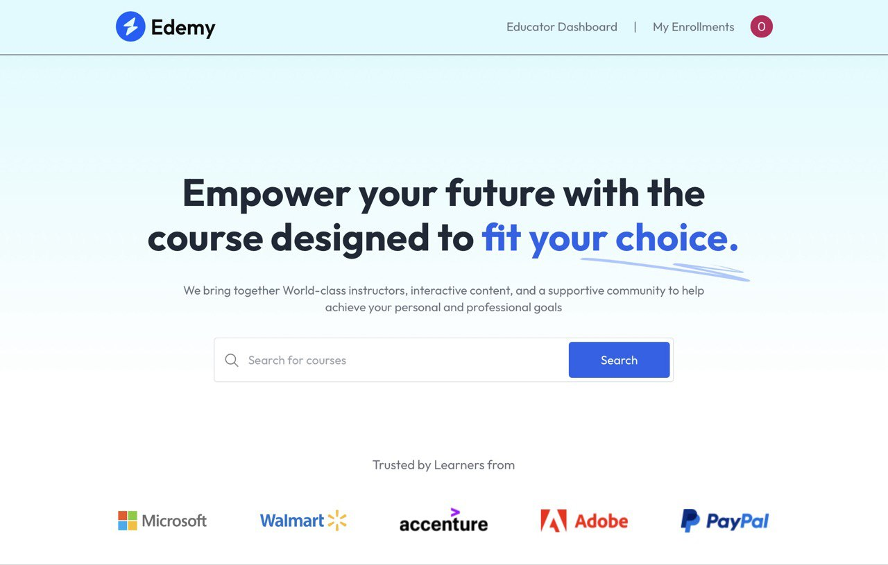
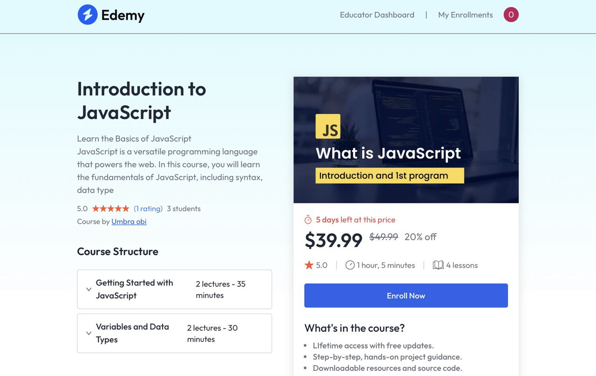
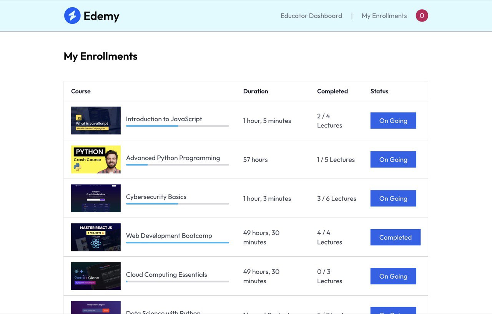
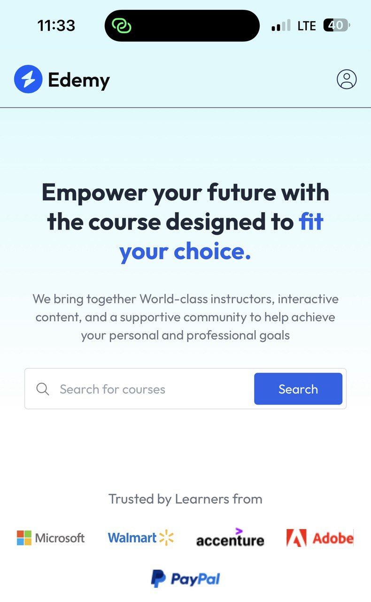

# 🎓 **EDEMY – Learning Management System (LMS)**

A modern **React + Vite**-powered **frontend LMS platform** designed for seamless online learning.  
**EDEMY** lets students enroll in courses, track progress, and watch lessons online — featuring secure authentication with **Clerk**, elegant UI styling via **Tailwind CSS**, smooth animations with **Framer Motion**, and state management using **Context API**.  

**Note:** This project is primarily a **frontend application**; course data is fetched from mock APIs or JSON and not backed by a full backend.  

**Live Demo:** (https://umbraobi-edemy.netlify.app/)

---

## 🖼️ **Screenshots**

  

---

## 🧰 **Tech Stack**

This project was built using the following technologies and tools:

### ⚛️ **Core Framework**
- **[React](https://react.dev/)** – Frontend library for building interactive learning interfaces  
- **[Vite](https://vitejs.dev/)** – Fast build tool and development server for modern React apps  

### 🧭 **Routing**
- **[React Router](https://reactrouter.com/)** – Client-side routing for managing pages like Home, Courses, and Dashboard  
  - Utilized `useNavigate` for smooth route transitions  

### 🔐 **Authentication & Security**
- **[Clerk Authentication](https://clerk.com/)** – Handles user registration, login, and session management securely  
  - Provides prebuilt components for **Sign In / Sign Up** and user profile management  

### 🎨 **Styling & UI**
- **[Tailwind CSS](https://tailwindcss.com/)** – Utility-first CSS framework for styling and responsive design  
  - Fully customized with Tailwind classes for a clean, modern LMS interface  

### 🎬 **Animations**
- **[Framer Motion](https://www.framer.com/motion/)** – Used for smooth scroll animations, hover effects, and component transitions  

### 🧩 **State Management & Data**
- **[Context API](https://reactjs.org/docs/context.html)** – Centralized state management for user and course data  
  - Stores course lists, enrolled courses, and user information globally across components  
- **Course Data Source** – All course information is fetched from internal APIs or JSON data and provided through Context  

### 🛠️ **Development Tools**
- **[ESLint](https://eslint.org/)** – Ensures consistent and clean code quality  

---
## 🚀 **Features**

- 🔐 **User Authentication** – Secure login and registration via Clerk  
- 🎓 **Course Enrollment** – Students can easily enroll in available courses  
- 🔍 **Course Search** – Users can search for courses by title or category  
- 🎥 **Online Learning Player** – Watch course videos directly inside the platform  
- 🌐 **Global State Management** – Context API handles data like courses and user info  
- ✨ **Smooth Animations** – Framer Motion used for scroll and hover effects  
- 🧭 **Intuitive Navigation** – Smooth and responsive routing between pages  
- 💻 **Responsive Design** – Fully optimized for desktop, tablet, and mobile users  
- ⚙️ **Scalable Architecture** – Built with reusability and future expansion in mind  

---
## 📦 **Dependencies / Libraries Used**

This project uses the following main dependencies:

- **@clerk/clerk-react** – Authentication and user management  
- **framer-motion** – Smooth animations and transitions  
- **humanize-duration** – Converts durations into human-readable formats  
- **quill** – Rich text editor for course content  
- **rc-progress** – Progress bars for course completion  
- **react** – Frontend library for building the interface  
- **react-dom** – React DOM rendering  
- **react-router-dom** – Client-side routing  
- **react-simple-star-rating** – Star rating component for courses  
- **react-toastify** – Toast notifications  
- **react-youtube** – Embedding YouTube videos  
- **uniqid** – Unique ID generation
